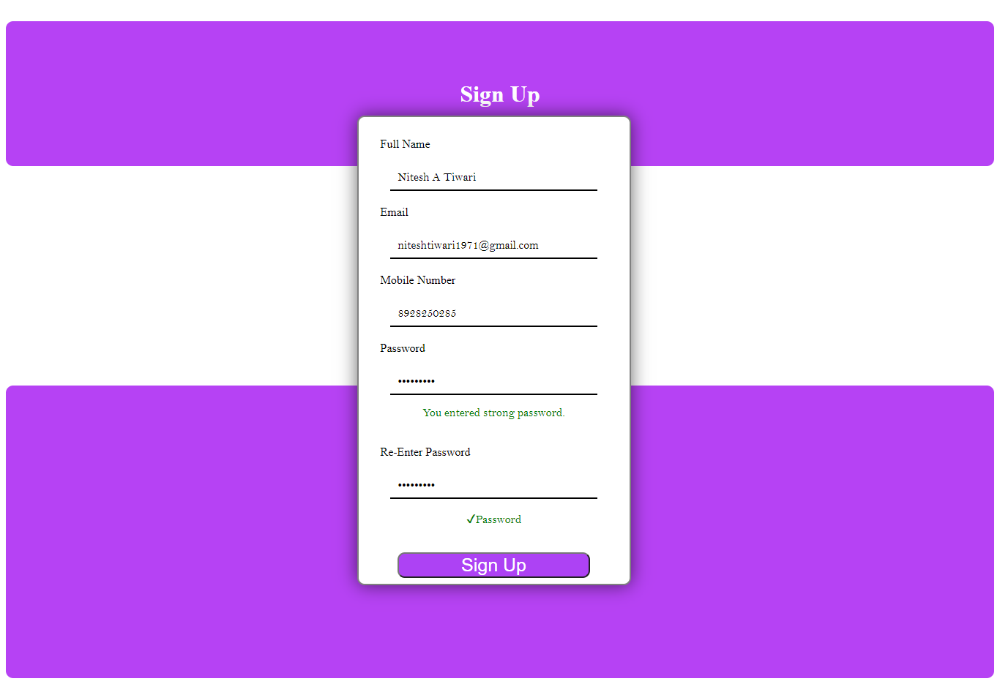
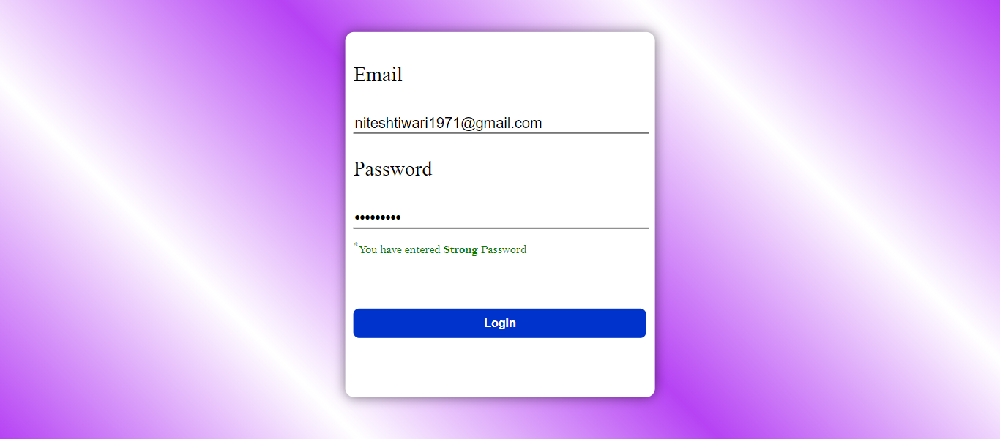
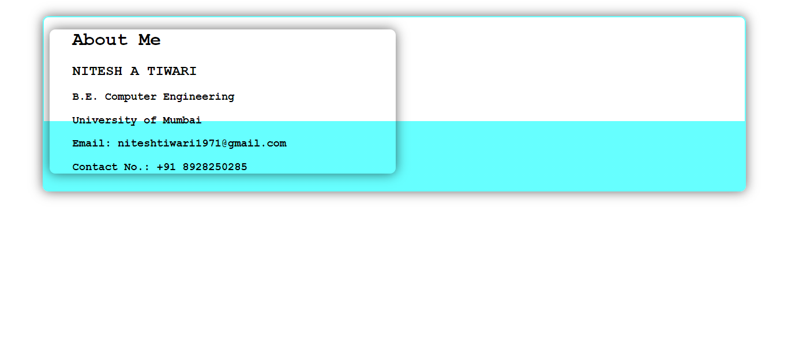
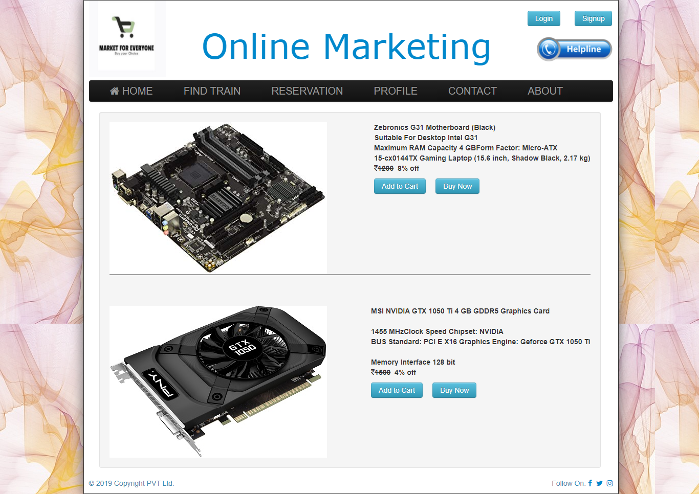
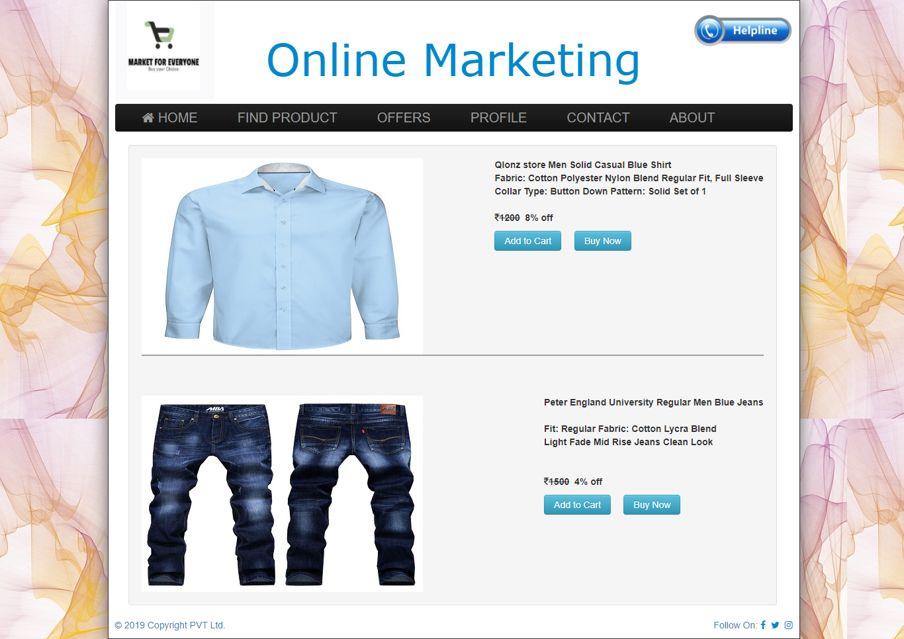
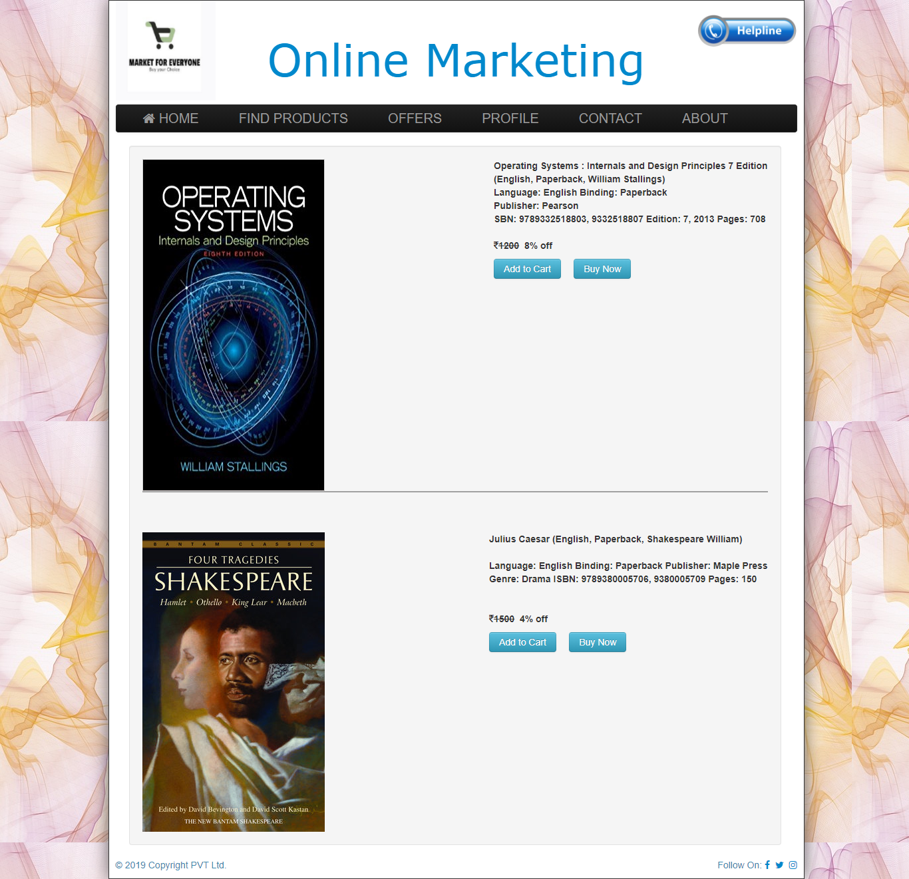
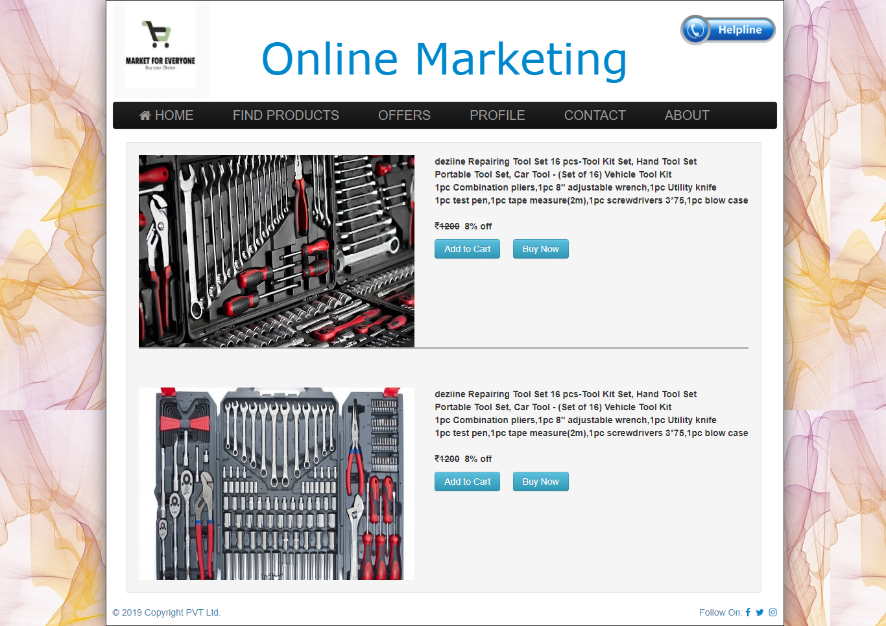
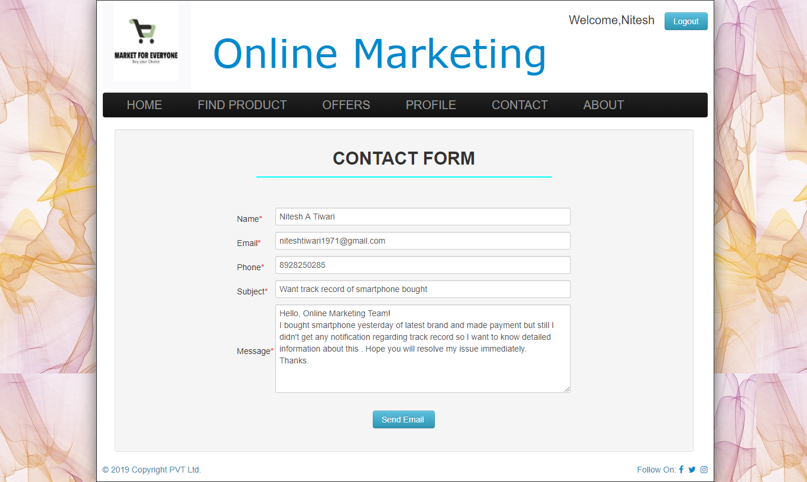

# Online-Auction
A web portal which helps customers to buy product just by clicking from anywhere.The name of the portal is Online Marketing. Customers have two options at home page ,either login or sign up the details.After login customer can buy different types of products according to choice.There are two options available after selecting any producys ,first is Buy Now and another is Add to Cart .In any of the options payment Gateway will be redirected in next steps then make a payment and product is yours! If customer is facing any issues with service then there is feedback and contact form is given .Customer can mail their issues and it will be resolved withing an hour of time .  

## To run the project follow these simple steps:  
### Step 1: Clone or Donwload the rar file from the repository
### Step 2: Copy the files in to htdocs for xampp server and in www for wamp server
### Step 3: Create 2 database files in the phpmyadmin namely marketing.sql and users.sql 
### Step 4: After creating the files you need to import the databases from the database folder.
### Step 5: After importing the database the system is ready to use just you need the open the home page of the system which is index.php 
### Step 6: Customer needs to login by clicking the login button and  if new to the system then signup the details.
### Step 7: After login customer needs to search the products according to requirement and  add to cart or buy now then do payment and product is yours! 
### Step 8: For any issue fill contact form and if want to suggest fill the chat form we will improve in short interval of time.
 

### Home page of System

### Login Form

### Sign up Form

### Products List

 ### Make Payment

### Contact From 

 
 
